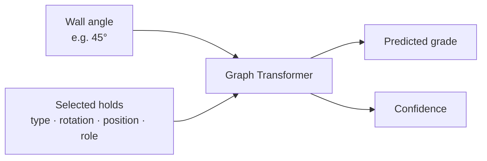

# Tension Grade Predictor

This project predicts the difficulty of a boulder problem on a **Tension Board 2
12x12**. A Tension Board is a standardized indoor climbing wall: the holds stay in
fixed positions, but climbers choose which ones belong to a problem.

Give the model the wall angle and the selected holds. It returns a V grade and its
confidence—for example, `V8` with `51%` confidence. The target is the community's
consensus grade at that particular angle, not an objective measure of difficulty.



## What the model learns from

Each selected hold becomes one point in a graph. The model receives:

- the hold type;
- its rotation and X/Y position;
- its role: start, hand, foot, or finish;
- the wall angle as a continuous numeric input.

It does **not** receive the layout name, climb name, placement ID, ascent count, or
known grade when making a prediction. Mirror and Spray are both training sources,
but the model is not told which layout an example came from.

The training dataset contains 21,809 community-graded `(climb, angle)` examples from
the Mirror and Spray layouts at 35°, 40°, 45°, 50°, and 55°. Input-equivalent,
renamed, and mirrored climbs are kept in the same data split to prevent the test set
from leaking into training.

## Machine learning approach

The model embeds every hold and uses pairwise geometry—such as distance, direction,
and wall-relative movement—to connect it to every other hold. Six graph-transformer
blocks with eight attention heads learn which holds and possible moves matter. An
ordinal-aware classifier then produces probabilities for `V0` through `V14`; those
probabilities are calibrated on the validation set before confidence is reported.

The canonical model has 2.85 million parameters. On the untouched test split of
2,174 examples it achieves:

- **1.028 V grades** mean absolute error;
- **73.64%** of predictions within one V grade;
- **32.84%** exact-grade accuracy.

Grades are subjective, so confidence means model confidence—not certainty that every
climber will experience the problem the same way.

## Use it

Python 3.10 or newer is required.

```bash
python3.12 -m venv .venv
source .venv/bin/activate
python -m pip install -e ".[data,dev]"

tension-predict checkpoints/tb2_12x12.pt examples/route.json
```

Example output:

```json
{"predicted_grade":"V8","confidence":0.5128}
```

Copy [`examples/route.json`](examples/route.json) and replace its angle and holds to
make a prediction. Coordinates are normalized to the board; rotations are degrees.

## Rebuild the data and model

Place the local Aurora database at `data/raw/tension.sqlite3`, then run:

```bash
tension-import-aurora data/raw/tension.sqlite3 \
  --query configs/aurora_tb2_12x12.sql \
  --catalog configs/tb2_12x12_hold_catalog.csv \
  --output data/processed/tb2_12x12.jsonl

tension-train data/processed/tb2_12x12.jsonl \
  --output checkpoints/tb2_12x12.pt
```

The database, generated dataset, and trained checkpoint are intentionally ignored by
Git. The versioned model specification is in
[`configs/tb2_12x12.json`](configs/tb2_12x12.json), and the full evaluation report is
in [`reports/tb2_12x12.metrics.json`](reports/tb2_12x12.metrics.json).

Run the checks with:

```bash
pytest
ruff check .
```
