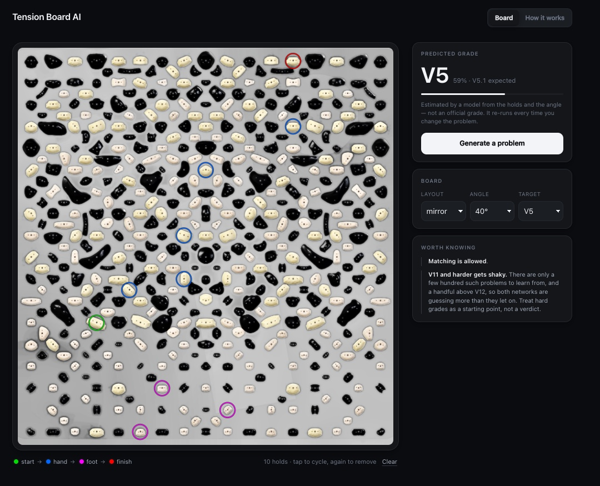

# Tension Board Lab

[](LICENSE)

Two small neural networks for boulder problems on a **Tension Board 2 12x12**, and a web app
that runs both of them in the browser with no backend. A Tension Board is a standardized indoor
climbing wall: the holds stay in fixed positions, and a problem is a choice of which ones you
may use.

One network **grades** a problem: a *graph transformer* that reads the selected holds as a set
of points looking at each other, and answers with a difficulty and how sure it is. The other
**invents** problems at a grade you ask for: a *decoder-only transformer*, the family behind
text autocomplete, placing holds one at a time instead of words. It uses the first as an
independent critic to judge what it produced. You can then edit the result and watch the grade
move.

Both were trained from scratch on this board's own history — no pretrained weights, and small
enough that the pair ships as 7 MB and runs in a browser tab.



## The parts

| Part | Documentation |
| --- | --- |
| Data pipeline and grade critic | [`src/tension_board_lab/`](src/tension_board_lab/README.md) |
| Boulder problem generator | [`src/tension_board_lab/`](src/tension_board_lab/README.md) |
| Web application | [`web/`](web/README.md) |

The **grade critic** is a 2.85M-parameter graph transformer. Given a wall angle and a set of
holds it outputs a score for each grade from V0 to V14, reported as the winner and its
probability — for example `V9` at `38%`. On its untouched test split of 2,174 problems it is off
by 0.935 V grades on average, and within one grade 78% of the time.

The **generator** is a 3.1M-parameter decoder-only transformer over `(position, role)` tokens.
Hard rules are applied as logit masks while sampling, so an invalid problem is unreachable
rather than unlikely: every evaluated sample was valid, and none reproduced a problem from the
corpus.

The **web application** ships both models as int8 ONNX and is tested for exact numerical parity
with the Python featurization — a drift there would show wrong grades rather than fail, so the
frontend is checked against tensors recorded from PyTorch.

## Setup

Python 3.10 or newer.

```bash
python3.12 -m venv .venv
source .venv/bin/activate
python -m pip install -e ".[data,dev]"
```

The models are trained on a local Aurora board database, which is not in this repository — so
the training checkpoints are not either, only the exported ones the web app runs. With a
checkpoint, grade a problem:

```bash
tension-predict checkpoints/grade/tb2_12x12.pt examples/route.json
```

```json
{"predicted_grade": "V9", "confidence": 0.3832}
```

Copy [`examples/route.json`](examples/route.json) and replace its angle and holds to make your
own prediction. Coordinates are normalized to the board; rotations are degrees.

## Checks

```bash
pytest
ruff check .
cd web && npm test && npx tsc --noEmit
```

The Python commands expect the repository root as the working directory.

## Repository layout

```
configs/               board layout catalog, Aurora SQL queries, model specification
data/                  local databases and generated datasets (git-ignored)
docs/                  design notes
checkpoints/<model>/   trained models (git-ignored)
reports/<model>/       evaluation reports
examples/              example input for tension-predict
src/tension_board_lab/ the Python package
tests/                 test suite, mirroring the package
web/                   the browser application
web/public/            the int8 models and board data the deployed app loads
```

Inside the package, the modules every model needs — the problem schema, the grade axis, the
Aurora import, the board catalog, and the batching and split logic — sit at the top level. Each
model gets its own subpackage below them: [`grade/`](src/tension_board_lab/grade/),
[`generator/`](src/tension_board_lab/generator/), and
[`export/`](src/tension_board_lab/export/). `checkpoints/` and `reports/` are split by model the
same way, so two models never contend for one filename.

Board databases, generated datasets and trained checkpoints are kept out of Git — the databases
may contain account-derived or licensed data, and the rest is reproducible from them with a
documented command. The exception is `web/public/`: the two int8 models and three JSON files the
deployed app loads at runtime are committed, so the site builds from a clone alone. They hold
model weights and board reference data, nothing account-derived. The fp32 graphs and the parity
fixtures stay out.

## License

MIT — see [LICENSE](LICENSE).
