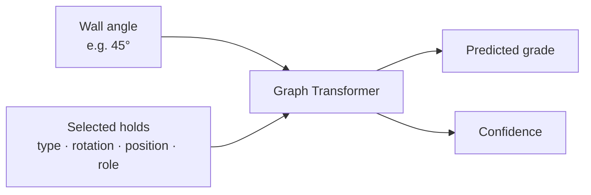

# Data pipeline and grade predictor

This package holds two things: the pipeline that turns a local Aurora database into training
data, and the model that predicts the difficulty of a boulder problem on a **Tension Board 2
12x12**.

Give the model the wall angle and the selected holds. It returns a V grade and its
confidence—for example, `V9` with `38%` confidence. The target is the community's consensus
grade at that particular angle, not an objective measure of difficulty.



## Modules

Shared modules sit at the top level of the package; the grade critic lives in `grade/`. A
`generator/` and an `export/` subpackage will join it—see
[`docs/roadmap.md`](../../docs/roadmap.md).

| Module | Purpose |
| --- | --- |
| `schema.py` | `RouteExample` and `HoldNode`, the canonical problem representation |
| `grades.py` | V-grade parsing and the ordinal grade axis |
| `aurora.py` | Import from the Aurora SQLite database into JSONL |
| `data.py` | Vocabulary, batching, and the split logic |
| `catalog.py` | The board's fixed placements; resolves a position to a hold |
| `style.py` | Rule-based style features, buckets, and presets |
| `grade/model.py` | The geometry-biased graph transformer and its loss |
| `grade/train.py` | Two-stage training, calibration, and evaluation |
| `grade/predict.py` | Single-problem inference |
| `generator/tokenizer.py` | Problem to token sequence for the generator |

## The data

The pipeline reads a local Aurora database and joins each problem's hold references against
[`../../configs/tb2_12x12_hold_catalog.csv`](../../configs/tb2_12x12_hold_catalog.csv), which
describes all 996 hold placements of the board—498 positions per layout, across the Mirror and
Spray layouts. Within one layout a coordinate identifies exactly one hold, so hold type and
rotation follow from the position.

Coordinates are normalized during import: `x = (raw_x + 64) / 128` and `y = (raw_y - 4) / 136`.
Everything downstream works in `[0, 1]`.

The consensus dataset contains 21,809 `(climb, angle)` examples with at least three
ascensionists from the Mirror and Spray layouts at 35°, 40°, 45°, 50°, and 55°. A typical
problem uses 10 holds; the largest uses 35.

### Splits and leakage

Examples are grouped by an exact signature of their model inputs before splitting, so
input-equivalent, renamed, and mirrored problems always land in the same split. Mirror-layout
problems are canonicalized by reflecting `x` and negating rotations, and the angle is
deliberately excluded from the signature—every angle of one hold set stays together. Grouping
is stratified by median grade and ordered by a hash, so splits are reproducible without a seed.

This yields 17,477 training, 2,158 validation, and 2,174 test examples, with zero duplicate and
zero cross-layout-equivalent groups across splits.

### Rebuilding the datasets

Place the local Aurora database at `data/raw/tension.sqlite3`, then run from the repository
root:

```bash
tension-import-aurora data/raw/tension.sqlite3 \
  --query configs/aurora_tb2_12x12.sql \
  --catalog configs/tb2_12x12_hold_catalog.csv \
  --output data/processed/tb2_12x12.jsonl

tension-import-aurora data/raw/tension.sqlite3 \
  --query configs/aurora_tb2_12x12_pretrain.sql \
  --catalog configs/tb2_12x12_hold_catalog.csv \
  --output data/processed/tb2_12x12_pretrain.jsonl
```

The two queries differ in one filter only: at least three ascensionists for the consensus set,
at least one for the pretraining set.

## What the model learns from

Each selected hold becomes one point in a graph. The model receives:

- the hold type;
- its rotation and X/Y position;
- its role: start, hand, foot, or finish;
- the wall angle as a continuous numeric input.

The hold-type token includes its material prefix—for example, `wood:SHLP` or `plastic:12`.
Material is not provided as an additional, separate feature.

It does **not** receive the layout name, climb name, placement ID, ascent count, or known grade
when making a prediction. Mirror and Spray are both training sources, but the model is not told
which layout an example came from.

## Architecture

The model embeds every hold and uses pairwise geometry—such as distance, direction, and
wall-relative movement—to connect it to every other hold. Six graph-transformer blocks with
eight attention heads learn which holds and possible moves matter. An ordinal-aware classifier
then produces probabilities for `V0` through `V14`; those probabilities are trained against
Aurora's unrounded community average. Validation temperature calibration turns them into the
reported confidence.

The canonical model has 2.85 million parameters.

## Training

Training happens in two stages. First, the model pretrains on 44,232 leakage-free examples:
18,045 with one grade, 8,710 with two, and 17,477 consensus training examples. One- and
two-ascent grades receive lower weights and wider soft targets. Every validation/test
configuration—and all its angles—is excluded from pretraining. The model is then fine-tuned
only on the 17,477 consensus training examples.

```bash
tension-train-grade data/processed/tb2_12x12.jsonl \
  --pretrain-dataset data/processed/tb2_12x12_pretrain.jsonl \
  --output checkpoints/grade/tb2_12x12.pt
```

## Results

On the untouched test split of 2,174 examples:

- **0.935 V grades** mean absolute error;
- **77.97%** of predictions within one V grade;
- **34.82%** exact-grade accuracy.

Accuracy tracks data density. At 35° the error is 0.849 V grades; at 55°, where only 389
examples exist, it is 1.063. Grades above V11 are similarly thin—212 examples at V12, 74 at
V13, and 3 at V14.

Grades are subjective, so confidence means model confidence—not certainty that every climber
will experience the problem the same way.

The versioned model specification is in
[`../../configs/tb2_12x12.json`](../../configs/tb2_12x12.json), and the full evaluation report
is in [`../../reports/grade/tb2_12x12.metrics.json`](../../reports/grade/tb2_12x12.metrics.json).

## Predicting

```bash
tension-predict checkpoints/grade/tb2_12x12.pt examples/route.json
```

```json
{"predicted_grade": "V9", "confidence": 0.3832}
```

See [`../../examples/route.json`](../../examples/route.json) for the input format.
