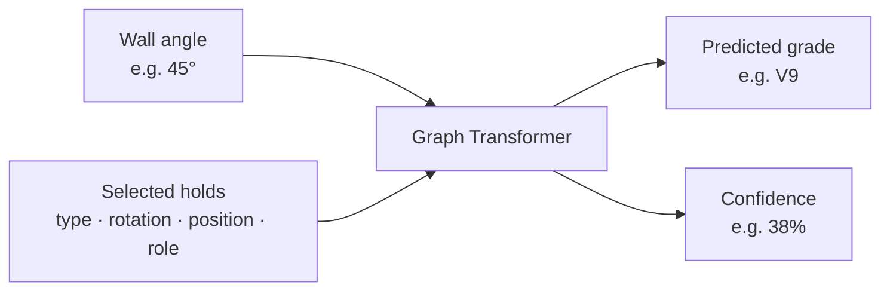

# Data pipeline, grade critic, and generator

A Tension Board is a climbing wall with a fixed grid of holds. A *problem* is a choice of which
of those holds you may use, and what each one is for: where you start, which are for hands,
which for feet, and which one ends the climb. The same wall holds tens of thousands of
different problems.

This package is three things, in the order they depend on each other.

---

## 1. The data pipeline

Climbers set problems in the Aurora app, climb each other's, and vote on how hard they were.
That history is a local database. The pipeline turns it into training data.

### What it keeps

It throws away everything the models must not see — who set the problem, what it is called, how
popular it is — and keeps only the physical facts: which holds, what each one is for, and how
steep the wall was. It also rewrites the board's raw numbers as `0` to `1` across the wall and
`0` to `1` up it, so nothing downstream depends on the board's own units.

Out come 21,809 problems that at least three people have climbed and graded, at five wall
angles. A typical one uses 10 holds; the largest uses 35. A second, larger set keeps everything
with at least one ascent — noisier, but useful for teaching a model what a problem looks like.

Before the data is split into training and test sets, problems are grouped by what a model would
actually see. A renamed copy, or the same problem mirrored left to right, lands in the same
group. Without that a model could be tested on a problem it had already memorized under another
name, and the reported accuracy would be fiction.

### Rebuilding the datasets

```bash
tension-import-aurora data/raw/tension.sqlite3 \
  --query configs/aurora_tb2_12x12.sql \
  --catalog configs/tb2_12x12_hold_catalog.csv \
  --output data/processed/tb2_12x12.jsonl
```

The second dataset uses `configs/aurora_tb2_12x12_pretrain.sql`; the two queries differ in one
filter only — three ascents versus one.

---

## 2. The grade critic

Show it a problem and how steep the wall is, and it tells you how hard the problem is and how
sure it is.



Climbing grades run V0, V1, V2 and upwards. The critic is not measuring anything objective — it
predicts what the climbing community would agree on, which is itself a matter of opinion. A
confidence of 38% means the model is fairly sure, not that 38% of climbers agree.

### How well it works

Every selected hold becomes a point. The model looks at each pair of points — how far apart, in
which direction, how that direction relates to the overhang — and learns which combinations of
reaches are hard. It never sees the problem's name, its popularity, or which of the two board
layouts it came from. 2.85 million parameters.

On 2,174 problems it had never seen, it is off by **0.935 V grades on average** and lands within
one grade **78%** of the time. For comparison, climbers routinely disagree by a grade.

Accuracy follows the data. At 35°, where there are many problems, the error is 0.849. At 55°,
where only 389 exist, it is 1.063. Above V11 the data thins the same way — 74 problems at V13,
three at V14 — so treat hard grades as informed guesses.

### Training and predicting

```bash
tension-train-grade data/processed/tb2_12x12.jsonl \
  --pretrain-dataset data/processed/tb2_12x12_pretrain.jsonl \
  --output checkpoints/grade/tb2_12x12.pt

tension-predict checkpoints/grade/tb2_12x12.pt examples/route.json
```

Input format: [`../../examples/route.json`](../../examples/route.json). Full report:
[`../../reports/grade/tb2_12x12.metrics.json`](../../reports/grade/tb2_12x12.metrics.json).

---

## 3. The generator

Ask for a grade and an angle, and it invents problems that do not exist yet. It works the way
phone keyboards predict the next word, except it is placing holds instead of words — one at a
time, bottom of the wall to top, each choice informed by everything already placed. It learned
by reading 44,000 real problems, so what it produces looks like something a person would set
rather than a random scatter of holds.

### How it works

*It picks positions, not holds.* The model says "position 47, for a hand" — the wall tells it
which hold is bolted there. That keeps its vocabulary at 2,182 choices instead of tens of
thousands. It is still *told* what hangs at each position, because that generalizes: 56 of the
106 hold types are used for one purpose more than 70% of the time, and knowing a hold is
foot-shaped transfers across every position it appears at.

*Impossible problems cannot be produced.* Rather than generating freely and discarding the
nonsense, illegal choices are switched off while it builds. A hold already used cannot be
reused; the climb cannot end before it has a start and a finish. Invalid output is unreachable,
not merely unlikely.

Every sample is valid, none reproduced a problem from the corpus, and candidates within a batch
are almost entirely distinct. Asked for a grade, the critic reads the result within about **0.9
V grades** on average. A dial called *guidance* trades one goal against the other: turn it up
and problems match the requested grade more closely, turn it down and they look more like real
problems.

What it still gets wrong: it learned which holds appear together, not how a body moves between
them. It can place a foot too far from the hold it is meant to support, or use a hold turned the
wrong way for the hand that would reach it. Harder problems suffer most, because there are fewer
of them to learn from.

### Training and sampling

```bash
tension-train-generator data/processed/tb2_12x12_pretrain.jsonl \
  --consensus-dataset data/processed/tb2_12x12.jsonl \
  --output checkpoints/generator/tb2_12x12.pt

tension-sample checkpoints/generator/tb2_12x12.pt \
  --critic checkpoints/grade/tb2_12x12.pt --grade V5 --angle 40

tension-eval-generator --output reports/generator/latest.metrics.json
```

The generator trains only on problems the critic never held out, using the same splitting code —
otherwise "the generator hits the target grade" would be measuring a leak. The mirror layout is
perfectly symmetric, so every problem on it is reflected to give a second real one: 36,169
training problems become 59,435.

One caveat on every number: grade accuracy here means *agreement with the critic*, not with
reality. It is meaningful only because the generator never saw the critic's test problems.

---

## Exporting for the browser

Both models convert to ONNX so the browser can run them without a server, alongside the JSON the
frontend needs — the board layout, the vocabularies, and reference numbers recorded from Python.

```bash
python -m pip install -e ".[export]"
tension-export-onnx
tension-export-web --database data/raw/tension.sqlite3
```

Compressed, the two models are 3.10 MB and 3.77 MB, and the compression is close to free: over
200 real problems the compressed critic agrees with the original on 98% of grades.

The reference numbers matter more than they sound. The browser has to reproduce the Python
featurization *exactly*; where it drifts, the app shows a confident wrong grade and nothing
errors. Recording real problems together with the tensors PyTorch produced for them turns the
most error-prone part of the project into something a test can check.

Everything written to `web/public/` is generated and git-ignored, like `checkpoints/` and
`data/processed/`.

---

## Modules

| Module | Purpose |
| --- | --- |
| `schema.py` | `RouteExample` and `HoldNode`, the canonical problem representation |
| `grades.py` | V-grade parsing and the ordinal grade axis |
| `aurora.py` | Import from the Aurora SQLite database into JSONL |
| `data.py` | Vocabulary, batching, and the split logic |
| `catalog.py` | The board's fixed placements; resolves a position to a hold |
| `grade/model.py` | The geometry-biased graph transformer and its loss |
| `grade/train.py` | Two-stage training, calibration, and evaluation |
| `grade/predict.py` | Single-problem inference |
| `generator/tokenizer.py` | Problem to token sequence |
| `generator/physical.py` | What is bolted at each position: hold type and orientation |
| `generator/constraints.py` | Legal-token masks that keep sampled problems valid |
| `generator/model.py` | The decoder-only transformer and its loss |
| `generator/train.py` | Training with classifier-free guidance and mirror augmentation |
| `generator/sample.py` | Sampling, critic scoring, and candidate ranking |
| `generator/evaluate.py` | Measurement harness with confidence intervals |
| `export/onnx.py` | Both models to ONNX |
| `export/artifacts.py` | Board catalog, vocabularies, and parity fixtures to JSON |
