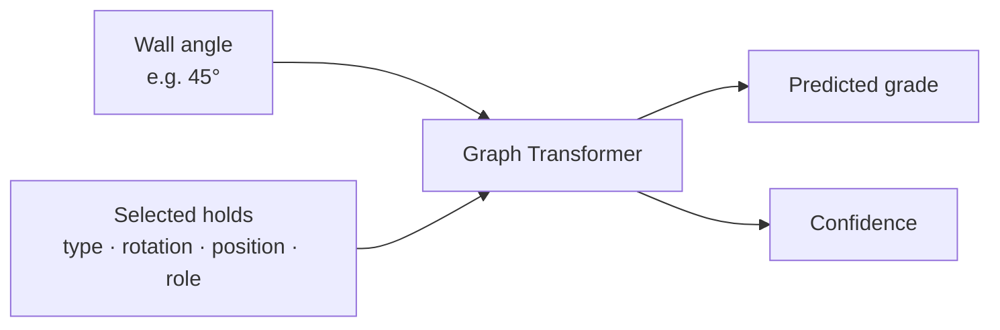

# Data pipeline, grade critic, and generator

This package holds three things for the **Tension Board 2 12x12**: the pipeline that turns a
local Aurora database into training data, the model that predicts how hard a boulder problem
is, and the model that invents new ones.

Give the **grade critic** the wall angle and the selected holds. It returns a V grade and its
confidence—for example, `V9` with `38%` confidence. The target is the community's consensus
grade at that particular angle, not an objective measure of difficulty.

Give the **generator** an angle and a grade, and it produces problems the critic then scores
and ranks.



## Modules

Shared modules sit at the top level of the package; each model has its own subpackage. An
`export/` subpackage will join them—see [`docs/roadmap.md`](../../docs/roadmap.md).

| Module | Purpose |
| --- | --- |
| `schema.py` | `RouteExample` and `HoldNode`, the canonical problem representation |
| `grades.py` | V-grade parsing and the ordinal grade axis |
| `aurora.py` | Import from the Aurora SQLite database into JSONL |
| `data.py` | Vocabulary, batching, and the split logic |
| `catalog.py` | The board's fixed placements; resolves a position to a hold |
| `grade/model.py` | The geometry-biased graph transformer and its loss |
| `grade/train.py` | Two-stage training, calibration, and evaluation |
| `grade/predict.py` | Single-problem inference |
| `generator/tokenizer.py` | Problem to token sequence for the generator |
| `generator/physical.py` | What is bolted at each position: hold type and orientation |
| `generator/constraints.py` | Legal-token masks that keep sampled problems valid |
| `generator/model.py` | The decoder-only transformer and its loss |
| `generator/train.py` | Generator training with classifier-free guidance |
| `generator/sample.py` | Sampling, critic scoring, and candidate ranking |
| `generator/evaluate.py` | Measurement harness with confidence intervals |

## The data

The pipeline reads a local Aurora database and joins each problem's hold references against
[`../../configs/tb2_12x12_hold_catalog.csv`](../../configs/tb2_12x12_hold_catalog.csv), which
describes all 996 hold placements of the board—498 positions per layout, across the Mirror and
Spray layouts. Within one layout a coordinate identifies exactly one hold, so hold type and
rotation follow from the position.

Coordinates are normalized during import: `x = (raw_x + 64) / 128` and `y = (raw_y - 4) / 136`.
Everything downstream works in `[0, 1]`.

The consensus dataset contains 21,809 `(climb, angle)` examples with at least three
ascensionists from the Mirror and Spray layouts at 35°, 40°, 45°, 50°, and 55°. A typical
problem uses 10 holds; the largest uses 35.

### Splits and leakage

Examples are grouped by an exact signature of their model inputs before splitting, so
input-equivalent, renamed, and mirrored problems always land in the same split. Mirror-layout
problems are canonicalized by reflecting `x` and negating rotations, and the angle is
deliberately excluded from the signature—every angle of one hold set stays together. Grouping
is stratified by median grade and ordered by a hash, so splits are reproducible without a seed.

This yields 17,477 training, 2,158 validation, and 2,174 test examples, with zero duplicate and
zero cross-layout-equivalent groups across splits.

### Rebuilding the datasets

Place the local Aurora database at `data/raw/tension.sqlite3`, then run from the repository
root:

```bash
tension-import-aurora data/raw/tension.sqlite3 \
  --query configs/aurora_tb2_12x12.sql \
  --catalog configs/tb2_12x12_hold_catalog.csv \
  --output data/processed/tb2_12x12.jsonl

tension-import-aurora data/raw/tension.sqlite3 \
  --query configs/aurora_tb2_12x12_pretrain.sql \
  --catalog configs/tb2_12x12_hold_catalog.csv \
  --output data/processed/tb2_12x12_pretrain.jsonl
```

The two queries differ in one filter only: at least three ascensionists for the consensus set,
at least one for the pretraining set.

## The grade critic

### What it learns from

Each selected hold becomes one point in a graph. The model receives:

- the hold type;
- its rotation and X/Y position;
- its role: start, hand, foot, or finish;
- the wall angle as a continuous numeric input.

The hold-type token includes its material prefix—for example, `wood:SHLP` or `plastic:12`.
Material is not provided as an additional, separate feature.

It does **not** receive the layout name, climb name, placement ID, ascent count, or known grade
when making a prediction. Mirror and Spray are both training sources, but the model is not told
which layout an example came from.

### Architecture

The model embeds every hold and uses pairwise geometry—such as distance, direction, and
wall-relative movement—to connect it to every other hold. Six graph-transformer blocks with
eight attention heads learn which holds and possible moves matter. An ordinal-aware classifier
then produces probabilities for `V0` through `V14`; those probabilities are trained against
Aurora's unrounded community average. Validation temperature calibration turns them into the
reported confidence.

The canonical model has 2.85 million parameters.

### Training

Training happens in two stages. First, the model pretrains on 44,232 leakage-free examples:
18,045 with one grade, 8,710 with two, and 17,477 consensus training examples. One- and
two-ascent grades receive lower weights and wider soft targets. Every validation/test
configuration—and all its angles—is excluded from pretraining. The model is then fine-tuned
only on the 17,477 consensus training examples.

```bash
tension-train-grade data/processed/tb2_12x12.jsonl \
  --pretrain-dataset data/processed/tb2_12x12_pretrain.jsonl \
  --output checkpoints/grade/tb2_12x12.pt
```

### Results

On the untouched test split of 2,174 examples:

- **0.935 V grades** mean absolute error;
- **77.97%** of predictions within one V grade;
- **34.82%** exact-grade accuracy.

Accuracy tracks data density. At 35° the error is 0.849 V grades; at 55°, where only 389
examples exist, it is 1.063. Grades above V11 are similarly thin—212 examples at V12, 74 at
V13, and 3 at V14.

Grades are subjective, so confidence means model confidence—not certainty that every climber
will experience the problem the same way.

The versioned model specification is in
[`../../configs/tb2_12x12.json`](../../configs/tb2_12x12.json), and the full evaluation report
is in [`../../reports/grade/tb2_12x12.metrics.json`](../../reports/grade/tb2_12x12.metrics.json).

### Predicting

```bash
tension-predict checkpoints/grade/tb2_12x12.pt examples/route.json
```

```json
{"predicted_grade": "V9", "confidence": 0.3832}
```

See [`../../examples/route.json`](../../examples/route.json) for the input format.

## The generator

A decoder-only transformer over token sequences, 3,116,038 parameters. A sequence is

```
[BOS] layout angle grade | hold hold ... hold | [EOS]
```

Within one layout a position identifies exactly one hold, so a hold token carries only
`(position, role)`—type and orientation come from the catalog. That keeps the vocabulary at
2,182 tokens and the longest sequence at 40.

The model is nevertheless *told* the hold type and orientation, as an additive embedding on
each token. Without it a token identifies only a position, so the model can learn what a
position affords only by memorizing each of the 537 separately. Hold type generalizes where
position cannot: 56 of the 106 types are used for one role more than 70% of the time,
`plastic:7` is a foot 99.4% of the time, and 70.3% of all foot placements sit on types that
are mostly feet. The same position carries a different hold on mirror than on spray, so the
layout is a second model input rather than something read off the tokens—guidance blanks the
request, not the wall.

Holds are emitted bottom to top, in `(y, x)` order. Problems are sets, not sequences, so the
order is a convention rather than a climbing sequence; it puts starts early and finishes late.

### Conditioning

The prefix has fixed width, so classifier-free guidance can blank it without shifting the
holds. Training replaces the whole prefix with `UNCOND` 10% of the time, which gives sampling a
guidance scale that trades variety for fidelity to the request.

### Training

The generator trains on problems with at least one ascent, minus every configuration the critic
holds out—44,234 problems, split 36,169 / 4,382 / 3,683 by the same `split_examples` the critic
uses. Sharing that function is the point: a copy would eventually drift and quietly invalidate
every "the generator hits the target grade" number.

The training split is then mirrored. The mirror layout is exactly symmetric—all 498 positions
have a partner carrying the same hold type—so reflecting a problem left to right yields another
real problem, and 64.7% of the pool is on that layout. That takes the training set from 36,169
to **59,435**. Only the training split is augmented; reflecting the holdouts would inflate them.

A reflected copy does **not** reliably inherit its original's signature, which is the obvious
thing to assume and is wrong. `encode` re-reads hold type and orientation from the catalog, and
17 of the 498 mirror positions are orientation-asymmetric, so 29.7% of copies canonicalize to a
different configuration than the problem they came from. Every copy is therefore checked
against the held-out signatures directly rather than trusted to inherit a split. On the current
data nothing is dropped—no copy collides—but the check is what makes that a guarantee instead
of a coincidence.

```bash
tension-train-generator data/processed/tb2_12x12_pretrain.jsonl \
  --consensus-dataset data/processed/tb2_12x12.jsonl \
  --output checkpoints/generator/tb2_12x12.pt
```

### Sampling

Hard rules are applied as logit masks during sampling rather than as a filter afterwards, so a
violation is unreachable instead of merely unlikely: positions off the layout are masked, a
used position retires all four of its roles, `EOS` stays blocked until the problem has a start
and a finish, and starts and finishes are held to loose height bounds.

```bash
tension-sample checkpoints/generator/tb2_12x12.pt \
  --critic checkpoints/grade/tb2_12x12.pt \
  --grade V5 --angle 40
```

Candidates go through the critic in one batch and are ranked by grade error and sequence
likelihood. The critic's **expectation** is used, not its argmax, which is too noisy to rank by
at around 38% confidence.

### Measuring it

```bash
tension-eval-generator --output reports/generator/latest.metrics.json
```

Ad-hoc sampling runs were too small to decide anything—two runs of about a hundred samples put
the grade error at guidance 2.5 at 0.752 and at 0.949. Every number the harness reports
therefore carries a bootstrap confidence interval, over roughly 240 samples per guidance scale,
with a fixed seed and on CPU so a run can be repeated exactly and compared across machines.

It reports grade error against the critic, roles and hold count against the corpus, novelty
against every configuration signature in the corpus, validity, and the mean pairwise Jaccard
distance within a candidate set. That last one had never been measured; candidates turn out to
be almost entirely distinct, around 0.96.

Two things to keep in mind reading it. Grade fidelity is agreement with the *critic*, not with
ground truth—meaningful only because the generator never saw the critic's holdout
configurations. And guidance trades one goal against the other: it sharpens grade fidelity
while pulling roles and hold counts away from the corpus, so the right setting is a choice, not
a maximum. Reports live in [`../../reports/generator/`](../../reports/generator/).

## Exporting for the browser

Both models go to ONNX, and everything else the frontend needs goes to JSON. Install the extra
first: `python -m pip install -e ".[export]"`.

```bash
tension-export-onnx
tension-export-web --database data/raw/tension.sqlite3
```

The int8 graphs are 3.10 MB for the critic and 3.77 MB for the generator. Quantization is
close to free: over 200 real problems the int8 critic agrees with fp32 on 98.0% of predicted
grades, and the fp32 graph matches PyTorch to about 1e-6.

| Artifact | Contents |
| --- | --- |
| `models/*.onnx`, `models/*.int8.onnx` | Both graphs, dynamic in batch and length |
| `data/board.json` | Every placement per layout, with raw coordinates and Aurora's role colors |
| `data/critic.json` | Hold-type indices, grade labels, temperature, and the input contract |
| `data/generator.json` | Token vocabulary, special tokens, layout order, sampling constraints |
| `data/fixtures.json` | Real problems with the tensors and logits PyTorch produced for them |
| `data/bluetooth.json` | Placement ids for the wall frames; needs `--database` |

Everything under `web/public/` is generated and git-ignored, like `checkpoints/` and
`data/processed/`. The fixtures and the placement-id table derive from the board database.

`fixtures.json` exists because the frontend has to reproduce `collate_routes` exactly, and a
mismatch there produces wrong grades rather than errors. Testing the TypeScript featurizer
against these recorded tensors turns the most error-prone part of the project into a checkable
one.

On precision: `--precision` offers fp32 and int8. The plan expected fp16 to break, because both
models mask attention with `torch.finfo(dtype).min`. Measured, it does not—PyTorch's softmax
subtracts the row maximum and saturates, so fp16 logits land within 0.01 of fp32 with identical
argmaxes. int8 is still preferred, at a quarter of the size. Note that onnxruntime-web's fp16
kernels are a different implementation and untested here.
