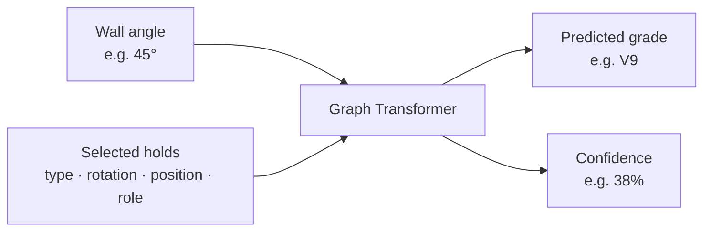
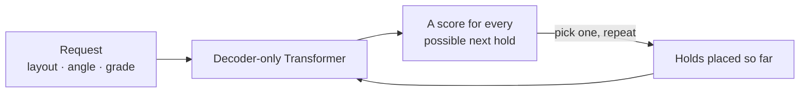

# Data pipeline, grade critic, and generator

A Tension Board is a climbing wall with a fixed grid of holds. A *problem* is a choice of which
of those holds you may use, and what each one is for: where you start, which are for hands,
which for feet, and which one ends the climb. The same wall holds tens of thousands of
different problems.

This package is three things, in the order they depend on each other.

---

## 1. The data pipeline

Climbers set problems in the Aurora app, climb each other's, and vote on how hard they were.
That history is a local database. The pipeline turns it into training data.

### What it keeps

It throws away everything the models must not see — who set the problem, what it is called, how
popular it is — and keeps only the physical facts: which holds, what each one is for, and how
steep the wall was. It also rewrites the board's raw numbers as `0` to `1` across the wall and
`0` to `1` up it, so nothing downstream depends on the board's own units.

Out come 21,809 problems that at least three people have climbed and graded, at five wall
angles. A typical one uses 10 holds; the largest uses 35. A second, larger set keeps everything
with at least one ascent — noisier, but useful for teaching a model what a problem looks like.

Before the data is split into training and test sets, problems are grouped by what a model would
actually see. A renamed copy, or the same problem mirrored left to right, lands in the same
group. Without that a model could be tested on a problem it had already memorized under another
name, and the reported accuracy would be fiction.

### Rebuilding the datasets

```bash
tension-import-aurora data/raw/tension.sqlite3 \
  --query configs/aurora_tb2_12x12.sql \
  --catalog configs/tb2_12x12_hold_catalog.csv \
  --output data/processed/tb2_12x12.jsonl
```

The second dataset uses `configs/aurora_tb2_12x12_pretrain.sql`; the two queries differ in one
filter only — three ascents versus one.

---

## 2. The grade critic

Show it a problem and how steep the wall is, and it tells you how hard the problem is and how
sure it is. It is a neural network — a *graph transformer*, trained from scratch on this board's
history. 2.85 million parameters, which is small: it fits in 3 MB and runs in a browser tab.



Climbing grades run V0, V1, V2 and upwards. The critic is not measuring anything objective — it
predicts what the climbing community would agree on, which is itself a matter of opinion. A
confidence of 38% means the model is fairly sure, not that 38% of climbers agree.

### Inside the network

**What goes in.** Not a picture of the wall. Each selected hold becomes a *node* described by
four numbers: which of the 106 hold types it is, how it is rotated, where it sits on the wall,
and what it is for. The wall angle comes along as a fifth input. A problem with nine holds is
therefore nine nodes plus one angle — no image, no fixed-size grid.

**What happens inside.** "Graph" means the holds are treated as a set of points that all look at
each other, rather than as a sequence or an image. Six layers of *attention* let every hold
weigh every other hold: which pairs form a hard reach, which foot supports which hand. Attention
alone only knows *that* two holds are in the problem, so each pair also gets a small bundle of
geometry — horizontal and vertical distance, direction, and how that direction relates to the
overhang — which nudges the attention toward physically meaningful pairs. Six blocks, eight
attention heads, 192 numbers wide.

**What comes out.** Fifteen numbers, one per grade from V0 to V14. Not a single predicted
number, and nothing symbolic — just a score for each possible answer:

```
raw scores   V0 …  V7    V8    V9   V10  … V14
            -2.0 … -0.2  3.95  4.13 2.15 … -2.2
                    ↓ softmax
probability  1%  …  3%   34%   38%  12%  …  1%
```

The highest score wins the label, and its probability is the reported confidence — here `V9` at
`38%`. Notice V8 sits at 34%, almost tied. That near-tie *is* the low confidence: the model is
saying "V9, but I would not argue with V8", which is roughly what climbers would say too.

Because it produces a full distribution rather than one number, the generator can use its
**expected value** — every grade weighted by its probability — instead of just the top label.
That is a steadier signal for ranking candidates than a winner that flips between neighbours.

### Training it

Training runs in two stages. First the network sees 44,232 problems including ones only one or
two people have climbed; their grades are unreliable, so they carry less weight and a
deliberately blurred target. Then it is fine-tuned on the 17,477 problems with at least three
ascents. Rough data first to learn the shape of the task, trustworthy data last to sharpen it.

Two details make the training fit the problem:

- **Soft, ordinal targets.** The community average is not a whole number — a problem may sit at
  V8.4 — so instead of a single correct answer the target is spread across neighbouring grades.
  An extra penalty scales with *how far* a prediction lands from the truth, because guessing V5
  for a V9 should hurt far more than guessing V8.
- **Temperature calibration.** A freshly trained network is overconfident. After training, a
  single number is fitted on held-out data to flatten the distribution until the stated
  confidence matches how often it is actually right. For this checkpoint it is **1.67** — the
  raw scores are divided by it before the softmax.

Standard machinery otherwise: AdamW, a cosine learning-rate schedule, and early stopping. This
checkpoint ran 30 epochs and kept epoch 18, where validation error was lowest.

The result, on 2,174 problems it had never seen: off by **0.935 V grades on average**, within
one grade **78%** of the time. For comparison, climbers routinely disagree by a grade.

Accuracy follows the data. At 35°, where there are many problems, the error is 0.849. At 55°,
where only 389 exist, it is 1.063. Above V11 the data thins the same way — 74 problems at V13,
three at V14 — so treat hard grades as informed guesses.

```bash
tension-train-grade data/processed/tb2_12x12.jsonl \
  --pretrain-dataset data/processed/tb2_12x12_pretrain.jsonl \
  --output checkpoints/grade/tb2_12x12.pt

tension-predict checkpoints/grade/tb2_12x12.pt examples/route.json
```

Input format: [`../../examples/route.json`](../../examples/route.json). Full report:
[`../../reports/grade/tb2_12x12.metrics.json`](../../reports/grade/tb2_12x12.metrics.json).

---

## 3. The generator

Ask for a grade and an angle, and it invents problems that do not exist yet. It is also a neural
network, but a different kind: a *decoder-only transformer*, the same family as the models
behind text autocomplete. It places holds instead of words — one at a time, bottom of the wall
to top, each choice informed by everything already placed. 3.1 million parameters.



It learned by reading 44,000 real problems, so what it produces looks like something a person
would set rather than a random scatter of holds.

### Inside the network

**What goes in.** A sequence of *tokens*, exactly like a sentence. The first four spell out the
request — a start marker, the layout, the angle, the grade — and every token after that is one
placed hold. A hold token is a single number standing for a `(position, role)` pair: "position
47, used as a hand". There are 2,182 such tokens in total, and a problem never runs past 40.

Crucially the model picks a *position*, not a hold — the wall tells it what is bolted there.
Otherwise every combination of hold type and place would need its own token and the vocabulary
would explode. It is still *told* what hangs at each position, because that knowledge
generalizes: 56 of the 106 hold types are used for one purpose more than 70% of the time, and
knowing a hold is foot-shaped transfers to every position it appears at.

**What happens inside.** Six transformer layers with eight attention heads, 192 numbers wide.
The attention is *causal*: when deciding the fifth hold it may look at the request and the four
holds already placed, never at what comes later. That is what makes generating one hold at a
time coherent rather than a lottery.

**What comes out.** For every place in the sequence, 2,182 numbers — one score per possible next
token. Only the last position matters while generating: it is the model's opinion about what to
place next. Softmaxed into probabilities, asked for a V6 at 40°, its first pick looks like this:

```
 8.5%  position (0.375, 0.000) as foot
 7.1%  position (0.625, 0.000) as foot
 5.3%  position (0.188, 0.000) as foot
 4.8%  position (0.250, 0.000) as foot
 4.7%  position (0.312, 0.000) as foot
```

Every one of the top five is a foot on the bottom row of the wall, which is exactly where a
problem starts. Nobody coded that rule; it came from the data.

**Impossible problems cannot be produced.** Before the pick, illegal choices are struck out —
their score set to minus infinity, so the probability is exactly zero. A hold already used
cannot be reused, positions on the other layout do not exist, and the climb cannot end before it
has a start and a finish. At the first step 1,860 of the 2,182 tokens survive. Invalid output is
unreachable rather than merely unlikely, and no candidate has to be thrown away afterwards.

### Training it

The training task is the one language models use: given everything so far, predict the next
token, and penalise being wrong. Nothing about climbing is encoded in the objective — the model
only ever learns to continue real problems plausibly.

The data is the 44,234 problems the critic never held out, split with the critic's own splitting
code. Sharing that code is the point: a copy would eventually drift and quietly invalidate every
"the generator hits the target grade" number. The training half is then mirrored — the mirror
layout is perfectly symmetric, so reflecting a problem left to right yields another real one,
taking 36,169 problems to **59,435**.

One trick earns the *guidance* dial. During training the request is blanked out 10% of the time,
so the model also learns what a problem looks like when nothing was asked for. At generation
time both are run and the difference between them is amplified: turn guidance up and problems
match the requested grade more closely, turn it down and they look more like real problems. It
is a genuine trade, not a setting with a best value.

AdamW, a cosine schedule, early stopping; this checkpoint ran 24 epochs and kept epoch 12.

Every sample is valid, none reproduced a problem from the corpus, and candidates within a batch
are almost entirely distinct. Asked for a grade, the critic reads the result within about **0.9
V grades** on average.

What it still gets wrong: it learned which holds appear together, not how a body moves between
them. It can place a foot too far from the hold it is meant to support, or use a hold turned the
wrong way for the hand that would reach it. Harder problems suffer most, because there are fewer
of them to learn from.

```bash
tension-train-generator data/processed/tb2_12x12_pretrain.jsonl \
  --consensus-dataset data/processed/tb2_12x12.jsonl \
  --output checkpoints/generator/tb2_12x12.pt

tension-sample checkpoints/generator/tb2_12x12.pt \
  --critic checkpoints/grade/tb2_12x12.pt --grade V5 --angle 40

tension-eval-generator --output reports/generator/latest.metrics.json
```

One caveat on every number: grade accuracy here means *agreement with the critic*, not with
reality. It is meaningful only because the generator never saw the critic's test problems.

---

## Exporting for the browser

Both models convert to ONNX so the browser can run them without a server, alongside the JSON the
frontend needs — the board layout, the vocabularies, and reference numbers recorded from Python.

```bash
python -m pip install -e ".[export]"
tension-export-onnx
tension-export-web --database data/raw/tension.sqlite3
```

Compressed, the two models are 3.10 MB and 3.77 MB, and the compression is close to free: over
200 real problems the compressed critic agrees with the original on 98% of grades.

The reference numbers matter more than they sound. The browser has to reproduce the Python
featurization *exactly*; where it drifts, the app shows a confident wrong grade and nothing
errors. Recording real problems together with the tensors PyTorch produced for them turns the
most error-prone part of the project into something a test can check.

Everything written to `web/public/` is generated and git-ignored, like `checkpoints/` and
`data/processed/`.

---

## Modules

| Module | Purpose |
| --- | --- |
| `schema.py` | `RouteExample` and `HoldNode`, the canonical problem representation |
| `grades.py` | V-grade parsing and the ordinal grade axis |
| `aurora.py` | Import from the Aurora SQLite database into JSONL |
| `data.py` | Vocabulary, batching, and the split logic |
| `catalog.py` | The board's fixed placements; resolves a position to a hold |
| `grade/model.py` | The geometry-biased graph transformer and its loss |
| `grade/train.py` | Two-stage training, calibration, and evaluation |
| `grade/predict.py` | Single-problem inference |
| `generator/tokenizer.py` | Problem to token sequence |
| `generator/physical.py` | What is bolted at each position: hold type and orientation |
| `generator/constraints.py` | Legal-token masks that keep sampled problems valid |
| `generator/model.py` | The decoder-only transformer and its loss |
| `generator/train.py` | Training with classifier-free guidance and mirror augmentation |
| `generator/sample.py` | Sampling, critic scoring, and candidate ranking |
| `generator/evaluate.py` | Measurement harness with confidence intervals |
| `export/onnx.py` | Both models to ONNX |
| `export/artifacts.py` | Board catalog, vocabularies, and parity fixtures to JSON |
